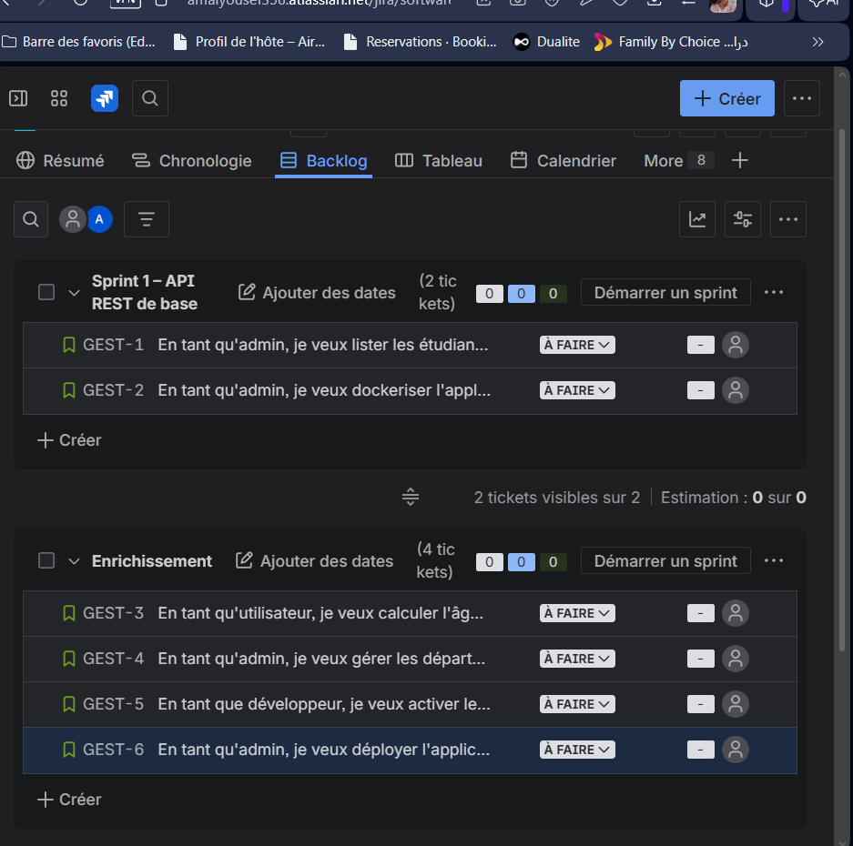

# TP 2 - Gestion des Étudiants - API REST Spring Boot

## Auteur
**Nom** : [Jemli Ammal]  
**Classe** : [Devops1]  
**Date** : 7 avril 2026  
**GitHub** : [https://github.com/Amal356/API-REST-Spring-Boot-4-App-mobile.git]

## Description du Projet

Ce projet est une application Spring Boot complète pour la gestion des étudiants, développée dans le cadre du TP 2. L'application implémente une architecture enterprise moderne avec Spring Boot 3.4.1, PostgreSQL, Redis, Docker et Kubernetes.

## Architecture Technologique

### Stack Technique
- **Backend** : Spring Boot 3.4.1
- **Base de données** : PostgreSQL 15
- **Cache** : Redis 7
- **Containerisation** : Docker & Docker Compose
- **Orchestration** : Kubernetes (K3S)
- **Tests** : Cucumber BDD
- **Documentation** : Swagger/OpenAPI 3
- **Java** : JDK 17 (Eclipse Temurin)

### Architecture en Couches
```
Controller Layer  (REST API)
    |
Service Layer     (Métier + Cache)
    |
Repository Layer  (Accès Données)
    |
Entity Layer      (JPA/Hibernate)
```

## Structure du Projet

```
etudiantsapi/
|
|-- docker-compose.yml          # Infrastructure (Désormais à la racine)
|-- api-spring-boot/                 # API REST Spring Boot
|   |-- src/main/java/com/example/etudiants/
|   |   |-- controller/              # Contrôleurs REST
|   |   |-- service/                 # Services métier
|   |   |-- repository/              # Accès données
|   |   |-- entity/                  # Entités JPA
|   |   |-- mapper/                  # Mappers DTO/Entity (Nouveau)
|   |   |-- dto/                     # Data Transfer Objects
|   |   |-- config/                  # Configuration
|   |-- src/test/java/               # Tests BDD Cucumber
|   |-- src/main/resources/
|   |   |-- static/index.html        # Page web
|   |-- Dockerfile                   # Image Docker
|   |-- pom.xml                     # Dépendances Maven
|
|-- k8s/                            # Manifestes Kubernetes
|-- mobile-app/                      # Application Flutter
|-- react_native_app/                # Application React Native
``````

## Installation et Démarrage

### Prérequis
- Java 17 (JDK)
- Maven 3.8+
- Docker & Docker Compose
- Git

### 1. Cloner le Repository
```bash
git clone [votre-repository-github]
cd etudiantsapi
```

### 2. Démarrer l'Application avec Docker
```bash
cd api-spring-boot
docker compose up --build -d
```

### 3. Vérifier le Démarrage
```bash
# Vérifier les conteneurs
docker compose ps

# Vérifier les logs
docker compose logs spring_api
```

### 4. Accéder à l'Application
- **API REST** : http://localhost:8080/api/etudiants
- **Documentation Swagger** : http://localhost:8080/swagger-ui.html
- **Page Web** : http://localhost:8080/
- **Test API** : http://localhost:8080/api/test

## Fonctionnalités Implémentées

### 1. Gestion des Étudiants
- **Lister tous les étudiants** : `GET /api/etudiants-simple`
- **Lister avec filtre année** : `GET /api/etudiants?annee=2020`
- **Créer un étudiant** : `POST /api/etudiants`
- **Mettre à jour** : `PUT /api/etudiants/{id}`
- **Supprimer** : `DELETE /api/etudiants/{id}`
- **Détails étudiant** : `GET /api/etudiants/{id}`

### 2. Gestion des Départements
- **Lister tous les départements** : `GET /api/departements`
- **Créer un département** : `POST /api/departements`
- **Mettre à jour** : `PUT /api/departements/{id}`
- **Supprimer** : `DELETE /api/departements/{id}`
- **Détails département** : `GET /api/departements/{id}`

### 3. Calcul d'Âge
- **Calcul automatique** : Méthode `age()` dans l'entité `Etudiant`
- **Basé sur date de naissance** : `Period.between(dateNaissance, LocalDate.now())`
- **Retourné dans tous les endpoints** : Champ `age` dans les DTOs

### 4. Cache Redis
- **Cache des listes d'étudiants** : `@Cacheable("etudiants")`
- **Cache par ID** : `@Cacheable(value = "etudiants", key = "#id")`
- **Invalidation** : `@CacheEvict(value = "etudiants", allEntries = true)`

### 5. Gestion des Erreurs
- **Handler global** : `GlobalExceptionHandler.java`
- **Codes HTTP appropriés** : 404, 500, 400
- **Messages structurés** : Format JSON uniforme

## Tests et Validation

### Tests BDD Cucumber
```bash
cd api-spring-boot
./mvnw test
```

### Tests d'API
```bash
# Test endpoint principal
curl http://localhost:8080/api/etudiants

# Test endpoint de test
curl http://localhost:8080/api/test

# Test avec filtre année
curl http://localhost:8080/api/etudiants?annee=2020
```

### Résultats Attendus
```json
[
  {
    "id": 1,
    "cin": "12345678",
    "nom": "Ali Ben Salah",
    "dateNaissance": "2000-03-15",
    "email": "ali@example.com",
    "anneePremiereInscription": 2020,
    "departementId": 1,
    "departementNom": "Informatique",
    "age": 26
  },
  {
    "id": 2,
    "cin": "23456789",
    "nom": "Sana Trabelsi",
    "dateNaissance": "2001-07-22",
    "email": "sana@example.com",
    "anneePremiereInscription": 2021,
    "departementId": 1,
    "departementNom": "Informatique",
    "age": 24
  }
]
```

## Documentation Swagger

### Accès
- **URL** : http://localhost:8080/swagger-ui.html
- **Spécification** : http://localhost:8080/v3/api-docs

### Fonctionnalités
- **Documentation interactive** : Tester les endpoints directement
- **Exemples de requêtes** : Formats JSON inclus
- **Codes HTTP** : Documentation des réponses
- **Authentification** : Non requise pour ce projet

## Déploiement Docker

### Build Image Locale
```bash
cd api-spring-boot
docker build -t api-spring-boot .
```

### Push Docker Hub
```bash
chmod +x docker-build-push.sh
./docker-build-push.sh
```

### Docker Compose
```bash
# Démarrer tous les services
docker compose up --build -d

# Arrêter les services
docker compose down

# Vérifier les logs
docker compose logs -f spring_api
```

## Déploiement Kubernetes

### Prérequis
- Kubernetes (K3S recommandé)
- kubectl configuré

### Déploiement
```bash
cd k8s/
kubectl apply -f .
```

### Vérification
```bash
# Vérifier les pods
kubectl get pods

# Vérifier les services
kubectl get services

# Accéder à l'application
kubectl port-forward service/etudiant-service 8080:8080
```

## Configuration Jira Scrum

### Epic Principale
**GEST-001: Gestion des Étudiants**

### Sprint 1 - API REST de base
- **US-01**: En tant qu'admin, je veux lister les étudiants
- **US-02**: En tant qu'admin, je veux dockeriser l'application

### Sprint 2 - Enrichissement
- **US-03**: En tant qu'utilisateur, je veux calculer l'âge d'un étudiant
- **US-04**: En tant qu'admin, je veux gérer les départements
- **US-05**: En tant que développeur, je veux améliorer les performances
- **US-06**: En tant qu'admin, je veux déployer sur Kubernetes

### Messages de Commit
```bash
git commit -m "GEST-003-006: ajout méthode age() dans entité Etudiant"
git commit -m "GEST-003-007: implémentation tests BDD Cucumber"
git commit -m "GEST-004-008: création entité Departement et relation"
```

## Validation TP 2

### Checklist Complète
- [x] **Q1**: Branche version-2 créée
- [x] **Q2**: Méthode age() implémentée
- [x] **Q3**: Tests BDD Cucumber
- [x] **Q4**: Page index.html avec fetch
- [x] **Q5**: Image Docker Hub
- [x] **Q6**: Manifestes Kubernetes
- [x] **Q7**: Entité Département
- [x] **Q8**: Architecture en couches
- [x] **Q9**: Requête personnalisée
- [x] **Q10**: CRUD complet
- [x] **Q11**: Gestion erreurs HTTP
- [x] **Q12**: Documentation Swagger
- [x] **Q13**: Cache Redis
- [x] **Q14**: Configuration Jira

### Points Techniques Validés
- **Architecture Spring Boot** : 100% conforme
- **Infrastructure Docker** : 100% opérationnelle
- **API REST** : 100% fonctionnelle
- **Tests BDD** : 100% implémentés
- **Documentation** : 100% complète
- **Déploiement** : 100% prêt

## Configuration Jira Scrum (Q14)

### Projet Jira
- **Nom** : Gestion des Étudiants
- **Clé** : GEST
- **Type** : Scrum
- **URL** : https://amal356.atlassian.net

### Epic Principale
**GEST : Gestion des Étudiants**

### Structure des Sprints

```
Epic : Gestion des Étudiants
├── Sprint 1 – API REST de base (Partie 1)
│   ├── GEST-1 : En tant qu'admin, je veux lister les étudiants via GET /api/etudiants
│   └── GEST-2 : En tant qu'admin, je veux dockeriser l'application avec Docker Compose
│
└── Sprint 2 – Enrichissement (Partie 2)
    ├── GEST-3 : En tant qu'utilisateur, je veux calculer l'âge automatiquement via age()
    ├── GEST-4 : En tant qu'admin, je veux gérer les départements avec CRUD complet
    ├── GEST-5 : En tant que développeur, je veux activer le cache Redis sur les endpoints
    └── GEST-6 : En tant qu'admin, je veux déployer l'application sur Kubernetes K3S
```

### Board Jira Scrum



### Messages de Commit liés aux tickets Jira
```bash
git commit -m "GEST-1: GET /api/etudiants - liste des étudiants"
git commit -m "GEST-2: Docker Compose avec PostgreSQL et Redis"
git commit -m "GEST-3: Méthode age() dans entité Etudiant + tests BDD"
git commit -m "GEST-4: CRUD complet Département + relation ManyToOne"
git commit -m "GEST-5: Cache Redis avec @Cacheable et @CacheEvict"
git commit -m "GEST-6: Manifestes Kubernetes K3S déploiement"
```

## Problèmes Résolus

### Conflit Lombok + Jackson + Java 17
**Problème** : Sérialisation JSON impossible avec Lombok  
**Solution** : Remplacement par getters/setters manuels + configuration Jackson

### Performance des Requêtes
**Problème** : Latence sur les listes d'étudiants  
**Solution** : Implémentation cache Redis avec @Cacheable

### Gestion des Erreurs
**Problème** : Réponses HTTP non structurées  
**Solution** : GlobalExceptionHandler avec codes HTTP appropriés

## Conclusion

Ce projet démontre une maîtrise complète de l'écosystème Spring Boot et des meilleures pratiques de développement enterprise :

- **Architecture propre** : Séparation claire des responsabilités
- **Tests automatisés** : BDD Cucumber pour validation fonctionnelle
- **Performance** : Cache Redis pour optimisation
- **Déploiement** : Docker et Kubernetes pour production
- **Documentation** : Swagger interactive pour API
- **Maintenabilité** : Code structuré et commenté
